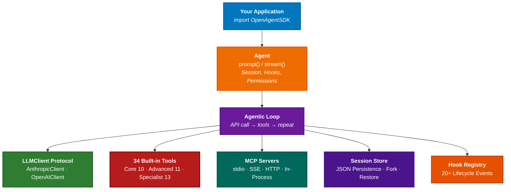

# Open Agent SDK (Swift)

[](https://swift.org)
[](https://developer.apple.com/macos/)
[](https://github.com/terryso/open-agent-sdk-swift/actions/workflows/ci.yml)
[](https://github.com/terryso/open-agent-sdk-swift/actions)
[](https://github.com/bmad-code-org/BMAD-METHOD)
[](./LICENSE)
[](https://deepwiki.com/terryso/open-agent-sdk-swift)

[中文文档](./README_CN.md)

Open-source Agent SDK for Swift — run the full agent loop **in-process** with native Swift concurrency. Build AI-powered applications with streaming responses, 34 built-in tools, sub-agent orchestration, MCP integration, session persistence, and multi-provider LLM support.

> **Inspired by** [open-agent-sdk-typescript](https://github.com/codeany-ai/open-agent-sdk-typescript) — bringing the same agentic architecture to the Swift ecosystem.

Also available in **TypeScript**: [open-agent-sdk-typescript](https://github.com/codeany-ai/open-agent-sdk-typescript) | **Go**: [open-agent-sdk-go](https://github.com/codeany-ai/open-agent-sdk-go)

## Highlights

- **Full Agent Loop** — Prompt, tool execution, and response in a single `await` call or streaming `AsyncStream`
- **34 Built-in Tools** — Core file/search/web tools, advanced task/team management, specialist cron/plan/worktree tools
- **Multi-Provider LLM** — Anthropic (Claude) and OpenAI-compatible APIs (GLM, Ollama, OpenRouter, etc.)
- **MCP Integration** — Connect external tools via stdio, SSE, HTTP, or in-process MCP servers
- **Session Persistence** — Save, load, fork, and manage conversation transcripts as JSON
- **Hook System** — 20+ lifecycle events with function and shell hook handlers
- **Permission Control** — 6 permission modes plus custom authorization callbacks with policy composition
- **Sub-Agent Orchestration** — Spawn child agents, manage teams, tasks, and inter-agent messaging
- **Auto-Compaction** — Automatically compresses long conversations to stay within context limits
- **Skills System** — 5 built-in skills (Commit, Review, Simplify, Debug, Test) with custom skill registration
- **File Cache & Context** — LRU file cache, Git status auto-injection, project document discovery (CLAUDE.md/AGENT.md)
- **Runtime Controls** — Dynamic model switching, query abort with partial results, session memory
- **Sandbox & Logging** — Configurable sandbox for command/path restrictions, structured JSON logging

## Quick Start (15 minutes)

### Installation

Add the dependency in your `Package.swift`:

```swift
dependencies: [
    .package(url: "https://github.com/terryso/open-agent-sdk-swift.git", from: "0.1.0")
],
targets: [
    .target(name: "YourApp", dependencies: ["OpenAgentSDK"])
]
```

Or in Xcode: **File > Add Package Dependencies** and enter the repository URL.

### Configuration

Set your API key via environment variable:

```bash
export CODEANY_API_KEY=sk-...
```

### Your First Agent

```swift
import OpenAgentSDK

let agent = createAgent(options: AgentOptions(
    apiKey: "sk-...",
    model: "claude-sonnet-4-6",
    systemPrompt: "You are a helpful assistant.",
    maxTurns: 10,
    permissionMode: .bypassPermissions
))

let result = await agent.prompt("Explain Swift concurrency in one paragraph.")
print(result.text)
print("Used \(result.usage.inputTokens) input + \(result.usage.outputTokens) output tokens")
```

### Streaming Response

```swift
// Using the agent created above:
for await message in agent.stream("Read Package.swift and summarize it.") {
    switch message {
    case .partialMessage(let data):
        print(data.text, terminator: "")
    case .toolUse(let data):
        print("Using tool: \(data.toolName)")
    case .result(let data):
        print("\nDone (\(data.numTurns) turns, $\(String(format: "%.4f", data.totalCostUsd)))")
    default:
        break
    }
}
```

### Custom Tools

```swift
struct WeatherInput: Codable {
    let city: String
}

let weatherTool = defineTool(
    name: "get_weather",
    description: "Get current weather for a city",
    inputSchema: [
        "type": "object",
        "properties": [
            "city": ["type": "string", "description": "City name"]
        ],
        "required": ["city"]
    ]
) { (input: WeatherInput, context: ToolContext) in
    return "Weather in \(input.city): 22C, sunny"
}

let agent = createAgent(options: AgentOptions(
    apiKey: "sk-...",
    tools: [weatherTool]
))
```

## Advanced Features

### Multi-Provider Support

Use OpenAI-compatible APIs (GLM, Ollama, OpenRouter, etc.):

```swift
let agent = createAgent(options: AgentOptions(
    provider: .openai,
    apiKey: "sk-...",
    model: "gpt-4o",
    baseURL: "https://api.openai.com/v1",
    systemPrompt: "You are a helpful assistant."
))
```

Or via environment variables:

```bash
export CODEANY_API_KEY=sk-...
export CODEANY_BASE_URL=https://api.openai.com/v1
export CODEANY_MODEL=gpt-4o
```

### Session Persistence

Save and restore conversation history:

```swift
let sessionStore = SessionStore()

let agent = createAgent(options: AgentOptions(
    apiKey: "sk-...",
    sessionStore: sessionStore,
    sessionId: "my-session"
))

// First conversation is auto-saved after prompt/stream
let result = await agent.prompt("Remember: my favorite color is blue.")

// Resume in a new process — history is auto-loaded
let agent2 = createAgent(options: AgentOptions(
    apiKey: "sk-...",
    sessionStore: sessionStore,
    sessionId: "my-session"
))
let result2 = await agent2.prompt("What is my favorite color?")
```

### Hook System

Register lifecycle event handlers:

```swift
let hookRegistry = HookRegistry()

await hookRegistry.register(.postToolUse, definition: HookDefinition(
    handler: { input in
        if let toolName = input.toolName {
            print("Tool completed: \(toolName)")
        }
        return nil
    }
))

await hookRegistry.register(.preToolUse, definition: HookDefinition(
    matcher: "Bash",
    handler: { input in
        return HookOutput(message: "Bash command blocked", block: true)
    }
))

let agent = createAgent(options: AgentOptions(
    apiKey: "sk-...",
    hookRegistry: hookRegistry
))
```

### Permission Control

Choose from 6 permission modes or define custom policies:

```swift
// Built-in modes
let agent = createAgent(options: AgentOptions(
    apiKey: "sk-...",
    permissionMode: .acceptEdits
))

// Custom authorization callback
agent.setCanUseTool { tool, input, context in
    if tool.name == "Bash" { return .deny("Bash is disabled") }
    return .allow()
}

// Policy composition
let policy = CompositePolicy(policies: [
    ReadOnlyPolicy(),
    ToolNameDenylistPolicy(deniedToolNames: ["WebFetch"])
])
agent.setCanUseTool(canUseTool(policy: policy))
```

### MCP Integration

Connect external tool servers via MCP (Model Context Protocol):

```swift
let agent = createAgent(options: AgentOptions(
    apiKey: "sk-...",
    mcpServers: [
        "filesystem": .stdio(McpStdioConfig(
            command: "npx",
            args: ["-y", "@modelcontextprotocol/server-filesystem", "/tmp"]
        )),
        "remote": .sse(McpSseConfig(
            url: "http://localhost:3001/sse"
        ))
    ]
))
// MCP tools are auto-discovered and merged into the agent's tool pool
```

### Budget Control

Set cost limits to cap LLM spending:

```swift
let agent = createAgent(options: AgentOptions(
    apiKey: "sk-...",
    maxBudgetUsd: 0.10  // Stop when cost exceeds $0.10
))
```

### Skills System

Register built-in or custom skills that encapsulate prompt templates and tool restrictions:

```swift
import OpenAgentSDK

// Built-in skills are auto-registered
let registry = SkillRegistry()
registry.register(BuiltInSkills.commit)
registry.register(BuiltInSkills.review)

// Register a custom skill
let explainSkill = Skill(
    name: "explain",
    description: "Explain code in detail",
    promptTemplate: "Read the specified files and explain the code line by line...",
    toolRestrictions: [.bash, .read, .glob, .grep]
)
registry.register(explainSkill)

let agent = createAgent(options: AgentOptions(
    apiKey: "sk-...",
    tools: getAllBaseTools(tier: .core) + [createSkillTool(registry: registry)]
))
```

### Runtime Model Switching

Switch LLM models mid-conversation with per-model cost tracking:

```swift
let agent = createAgent(options: AgentOptions(
    apiKey: "sk-...",
    model: "claude-sonnet-4-6"
))

// Use fast model for simple queries
let result1 = await agent.prompt("Quick question...")

// Switch to powerful model for complex tasks
try agent.switchModel("claude-opus-4-6")
let result2 = await agent.prompt("Analyze this complex codebase...")
// result2.usage.costBreakdown contains separate entries per model
```

### Query Abort

Cancel running queries and retrieve partial results:

```swift
let task = Task {
    for await message in agent.stream("Long-running analysis...") {
        // process events
    }
}

// Cancel after timeout
task.cancel()
// The agent returns a QueryResult with isCancelled=true and partial results
```

### Context Injection

Automatic Git status and project document discovery:

```swift
let agent = createAgent(options: AgentOptions(
    apiKey: "sk-...",
    projectRoot: "/path/to/project"  // auto-discovers CLAUDE.md, AGENT.md
))
// System prompt now includes <git-context> and <project-instructions> blocks
```

### Sandbox & Logging

Restrict agent operations and capture structured logs:

```swift
let agent = createAgent(options: AgentOptions(
    apiKey: "sk-...",
    sandbox: SandboxSettings(
        allowedReadPaths: ["/project/"],
        allowedWritePaths: ["/project/src/"],
        deniedCommands: ["rm", "sudo"]
    ),
    logLevel: .debug,
    logOutput: .custom { jsonLine in
        // Integrate with ELK, Datadog, etc.
        print(jsonLine)
    }
))
```

## Built-in Tools

### Core Tools (10)

| Tool          | Description                                    |
| ------------- | ---------------------------------------------- |
| **Bash**      | Execute shell commands with timeout            |
| **Read**      | Read file contents                             |
| **Write**     | Create or overwrite files                      |
| **Edit**      | Find and replace in files                      |
| **Glob**      | Search files by pattern                        |
| **Grep**      | Search file contents with regex                |
| **WebFetch**  | Fetch and read web pages                       |
| **WebSearch** | Search the web                                 |
| **AskUser**   | Ask user for input during execution            |
| **ToolSearch**| Search available tools                         |

### Advanced Tools (11)

| Tool              | Description                                          |
| ----------------- | ---------------------------------------------------- |
| **Agent**         | Spawn sub-agents (Explore, Plan types)               |
| **SendMessage**   | Send messages between agents                         |
| **TaskCreate**    | Create tasks with descriptions                       |
| **TaskList**      | List all tasks with status filtering                 |
| **TaskUpdate**    | Update task status and owner                         |
| **TaskGet**       | Get task details by ID                               |
| **TaskStop**      | Stop a running task                                  |
| **TaskOutput**    | Get output from a completed task                     |
| **TeamCreate**    | Create a team for multi-agent coordination           |
| **TeamDelete**    | Delete a team and clean up resources                 |
| **NotebookEdit**  | Edit Jupyter notebook cells                          |

### Specialist Tools (13)

| Tool                 | Description                                          |
| -------------------- | ---------------------------------------------------- |
| **WorktreeEnter**    | Enter an isolated worktree workspace                 |
| **WorktreeExit**     | Exit and optionally remove a worktree                |
| **PlanEnter**        | Enter plan mode for structured planning              |
| **PlanExit**         | Exit plan mode and return to execution               |
| **CronCreate**       | Schedule a recurring task                            |
| **CronDelete**       | Delete a scheduled task                              |
| **CronList**         | List all scheduled tasks                             |
| **RemoteTrigger**    | Trigger a remote webhook or event                    |
| **LSP**              | Language Server Protocol integration                 |
| **Config**           | Read and write SDK configuration values              |
| **TodoWrite**        | Manage todo lists with priorities                    |
| **ListMcpResources** | List available MCP server resources                  |
| **ReadMcpResource**  | Read a specific MCP resource                         |

## Architecture



## Environment Variables

| Variable             | Description                                        |
| -------------------- | -------------------------------------------------- |
| `CODEANY_API_KEY`    | API key (required)                                 |
| `CODEANY_MODEL`      | Default model (default: `claude-sonnet-4-6`)       |
| `CODEANY_BASE_URL`   | Custom API endpoint for third-party providers      |

## Documentation

API documentation and guides are available via Swift-DocC:

- [Getting Started](Sources/OpenAgentSDK/Documentation.docc/GettingStarted.md) — 15-minute walkthrough
- [Tool System](Sources/OpenAgentSDK/Documentation.docc/ToolSystem.md) — Tool protocol, custom tools, tiers
- [Multi-Agent Orchestration](Sources/OpenAgentSDK/Documentation.docc/MultiAgent.md) — Sub-agents, teams, tasks
- [MCP, Sessions & Hooks](Sources/OpenAgentSDK/Documentation.docc/MCPSessionHooks.md) — MCP integration, persistence, hook system
- [Runnable Examples](Examples/README.md) — 31 complete examples with step-by-step tutorial (19 feature demos + 12 compat verification)

## Requirements

- Swift 6.1+
- macOS 13+

## Development

```bash
# Build
swift build

# Run tests
swift test

# Open in Xcode
open Package.swift
```

## Acknowledgments

This project is inspired by [open-agent-sdk-typescript](https://github.com/codeany-ai/open-agent-sdk-typescript), which provides the same agentic architecture for the TypeScript/Node.js ecosystem.

## License

MIT
