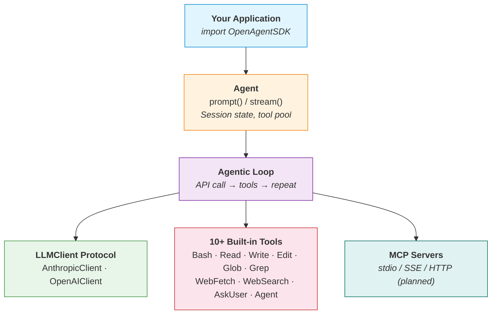

# Open Agent SDK (Swift)

[](https://swift.org)
[](https://developer.apple.com/macos/)
[](https://github.com/terryso/open-agent-sdk-swift/actions/workflows/ci.yml)
[](https://github.com/terryso/open-agent-sdk-swift/actions)
[](https://github.com/bmad-code-org/BMAD-METHOD)
[](./LICENSE)

[中文文档](./README_CN.md)

Open-source Agent SDK for Swift — run the full agent loop **in-process** with native Swift concurrency. Build AI-powered applications with streaming responses, 10+ built-in tools, sub-agent support, and multi-provider LLM integration.

> **Inspired by** [open-agent-sdk-typescript](https://github.com/codeany-ai/open-agent-sdk-typescript) — bringing the same agentic architecture to the Swift ecosystem.

Also available in **TypeScript**: [open-agent-sdk-typescript](https://github.com/codeany-ai/open-agent-sdk-typescript) | **Go**: [open-agent-sdk-go](https://github.com/codeany-ai/open-agent-sdk-go)

## Status

**Implemented:**
- [x] Type system (messages, tools, errors, permissions, sessions, hooks)
- [x] SDK configuration (environment variables + programmatic)
- [x] Multi-provider LLM support (Anthropic + OpenAI-compatible APIs)
- [x] Agent creation with full agentic loop
- [x] Streaming and blocking query APIs
- [x] 10 built-in tools (Bash, Read, Write, Edit, Glob, Grep, WebFetch, WebSearch, AskUser, ToolSearch)
- [x] Sub-agent spawning (Agent tool with built-in Explore/Plan agents)
- [x] Tool registry with deduplication and filtering
- [x] Error handling with retry logic
- [x] CI pipeline with code coverage

**In Progress / Planned:**
- [ ] MCP (Model Context Protocol) integration
- [ ] Session persistence
- [ ] Hook system execution (types defined)
- [ ] Budget tracking
- [ ] Permission enforcement
- [ ] Auto-compaction
- [ ] NotebookEdit tool

## Installation

### Swift Package Manager

Add the dependency in your `Package.swift`:

```swift
dependencies: [
    .package(url: "https://github.com/terryso/open-agent-sdk-swift.git", from: "0.1.0")
],
targets: [
    .target(name: "YourApp", dependencies: ["OpenAgentSDK"])
]
```

### Xcode

File > Add Package Dependencies > enter the repository URL.

## Quick Start

### Configuration

Set your API key via environment variable:

```bash
export CODEANY_API_KEY=your-api-key
```

Or configure programmatically:

```swift
import OpenAgentSDK

let config = SDKConfiguration(
    apiKey: "sk-...",
    model: "claude-sonnet-4-6",
    baseURL: nil  // optional, for third-party providers
)
```

### Create an Agent

```swift
import OpenAgentSDK

let agent = createAgent(options: AgentOptions(
    apiKey: "sk-...",
    model: "claude-sonnet-4-6",
    systemPrompt: "You are a helpful assistant.",
    maxTurns: 10,
    permissionMode: .bypassPermissions
))
```

### Blocking Query

```swift
let result = await agent.prompt("Read Package.swift and tell me the project name.")
print(result.text)
print("Used \(result.usage.inputTokens) input + \(result.usage.outputTokens) output tokens")
```

### Streaming Query

```swift
for await message in agent.stream("Read Package.swift and tell me the project name.") {
    switch message {
    case .assistant(let data):
        print(data.text)
    case .toolUse(let data):
        print("Using tool: \(data.toolName)")
    case .result(let data):
        print("Done: \(data.text)")
    default:
        break
    }
}
```

### Multi-Provider Support

Use OpenAI-compatible APIs (GLM, Ollama, OpenRouter, etc.):

```swift
let agent = createAgent(options: AgentOptions(
    provider: .openai,
    apiKey: "your-openai-key",
    model: "gpt-4o",
    baseURL: "https://api.openai.com/v1",
    systemPrompt: "You are a helpful assistant."
))
```

Or via environment variables:

```bash
export CODEANY_API_KEY=your-key
export CODEANY_BASE_URL=https://api.openai.com/v1
export CODEANY_MODEL=gpt-4o
# Agent will auto-detect provider from base URL
```

### Custom Tools

```swift
import OpenAgentSDK

let myTool = defineTool(
    name: "get_weather",
    description: "Get current weather for a city",
    inputSchema: [
        "type": "object",
        "properties": [
            "city": ["type": "string", "description": "City name"]
        ],
        "required": ["city"]
    ]
) { input, context in
    let city = input["city"] as? String ?? "Unknown"
    return "Weather in \(city): 22°C, sunny"
}

let agent = createAgent(options: AgentOptions(
    apiKey: "sk-...",
    tools: [myTool]
))
```

## Architecture



## Environment Variables

| Variable             | Description                              |
| -------------------- | ---------------------------------------- |
| `CODEANY_API_KEY`    | API key (required)                       |
| `CODEANY_MODEL`      | Default model (default: `claude-sonnet-4-6`) |
| `CODEANY_BASE_URL`   | Custom API endpoint for third-party providers |

## Built-in Tools

| Tool         | Description                                    | Status |
| ------------ | ---------------------------------------------- | ------ |
| **Bash**     | Execute shell commands with timeout            | ✅      |
| **Read**     | Read file contents                             | ✅      |
| **Write**    | Create or overwrite files                      | ✅      |
| **Edit**     | Find and replace in files                      | ✅      |
| **Glob**     | Search files by pattern                        | ✅      |
| **Grep**     | Search file contents with regex                | ✅      |
| **WebFetch** | Fetch and read web pages                       | ✅      |
| **WebSearch**| Search the web                                 | ✅      |
| **AskUser**  | Ask user for input during execution            | ✅      |
| **ToolSearch**| Search available tools                        | ✅      |
| **Agent**    | Spawn sub-agents (Explore, Plan types)         | ✅      |

## Requirements

- Swift 6.1+
- macOS 13+

## Development

```bash
# Build
swift build

# Run tests
swift test

# Open in Xcode
open Package.swift
```

## Acknowledgments

This project is inspired by [open-agent-sdk-typescript](https://github.com/codeany-ai/open-agent-sdk-typescript), which provides the same agentic architecture for the TypeScript/Node.js ecosystem.

## License

MIT
