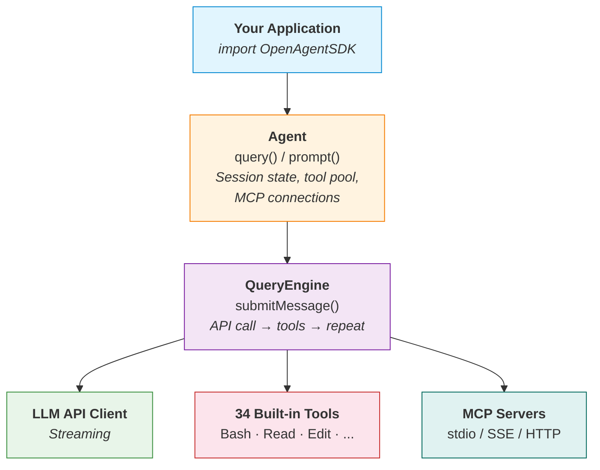

# Open Agent SDK (Swift)

[](https://swift.org)
[](https://developer.apple.com/macos/)
[](https://github.com/terryso/open-agent-sdk-swift/actions/workflows/ci.yml)
[](https://github.com/terryso/open-agent-sdk-swift/actions)
[](https://github.com/bmad-code-org/BMAD-METHOD)
[](./LICENSE)

[中文文档](./README_CN.md)

Open-source Agent SDK for Swift — run the full agent loop **in-process** with native Swift concurrency. Build AI-powered applications with streaming responses, built-in tools, and MCP support.

> **Inspired by** [open-agent-sdk-typescript](https://github.com/codeany-ai/open-agent-sdk-typescript) — bringing the same agentic architecture to the Swift ecosystem.

Also available in **TypeScript**: [open-agent-sdk-typescript](https://github.com/codeany-ai/open-agent-sdk-typescript) | **Go**: [open-agent-sdk-go](https://github.com/codeany-ai/open-agent-sdk-go)

## Status

This project is in **early development**. The foundation (type system, configuration, API client, agent creation) is in place, with the agentic loop, built-in tools, and advanced features coming soon.

**Implemented:**
- [x] Type system (messages, tools, errors, permissions, sessions, hooks)
- [x] SDK configuration (environment variables + programmatic)
- [x] Anthropic API client with streaming support
- [x] Agent creation and configuration
- [x] CI pipeline

**In Progress / Planned:**
- [ ] Agentic loop (QueryEngine)
- [ ] 34 built-in tools (Bash, Read, Write, Edit, Glob, Grep, ...)
- [ ] MCP (Model Context Protocol) integration
- [ ] Session persistence
- [ ] Hook system (21 lifecycle events)
- [ ] Multi-agent orchestration
- [ ] Budget tracking
- [ ] Permission system
- [ ] Auto-compaction

## Installation

### Swift Package Manager

Add the dependency in your `Package.swift`:

```swift
dependencies: [
    .package(url: "https://github.com/terryso/open-agent-sdk-swift.git", from: "0.1.0")
],
targets: [
    .target(name: "YourApp", dependencies: ["OpenAgentSDK"])
]
```

### Xcode

File > Add Package Dependencies > enter the repository URL.

## Quick Start

### Configuration

Set your API key via environment variable:

```bash
export CODEANY_API_KEY=your-api-key
```

Or configure programmatically:

```swift
import OpenAgentSDK

let config = SDKConfiguration(
    apiKey: "sk-...",
    model: "claude-sonnet-4-6",
    baseURL: nil  // optional, for third-party providers
)
```

Third-party providers (e.g. OpenRouter) are supported via `CODEANY_BASE_URL`:

```bash
export CODEANY_BASE_URL=https://openrouter.ai/api
export CODEANY_API_KEY=sk-or-...
export CODEANY_MODEL=anthropic/claude-sonnet-4
```

### Create an Agent

```swift
import OpenAgentSDK

let agent = createAgent(options: AgentOptions(
    apiKey: "sk-...",
    model: "claude-sonnet-4-6",
    systemPrompt: "You are a helpful assistant.",
    maxTurns: 10,
    permissionMode: .bypassPermissions
))
```

### Streaming Query (coming soon)

```swift
for await message in agent.query("Read Package.swift and tell me the project name.") {
    switch message {
    case .assistant(let content):
        print(content)
    case .toolUse(let tool, let input):
        print("Using tool: \(tool)")
    case .result(let summary):
        print("Done: \(summary)")
    default:
        break
    }
}
```

## Architecture



## Environment Variables

| Variable             | Description            |
| -------------------- | ---------------------- |
| `CODEANY_API_KEY`    | API key (required)     |
| `CODEANY_MODEL`      | Default model override |
| `CODEANY_BASE_URL`   | Custom API endpoint    |

## Built-in Tools (Planned)

| Tier        | Tools                                                                 |
| ----------- | --------------------------------------------------------------------- |
| **Core**    | Bash, Read, Write, Edit, Glob, Grep, WebFetch, WebSearch, AskUser, ToolSearch |
| **Advanced**| NotebookEdit, Agent (subagents), Task management, Team coordination, SendMessage, EnterWorktree, EnterPlanMode |
| **Specialist** | LSP, MCP resources, Cron scheduling, Remote triggers, Config |

## Requirements

- Swift 6.1+
- macOS 13+

## Development

```bash
# Build
swift build

# Run tests
swift test

# Open in Xcode
open Package.swift
```

## Acknowledgments

This project is inspired by [open-agent-sdk-typescript](https://github.com/codeany-ai/open-agent-sdk-typescript), which provides the same agentic architecture for the TypeScript/Node.js ecosystem.

## License

MIT
