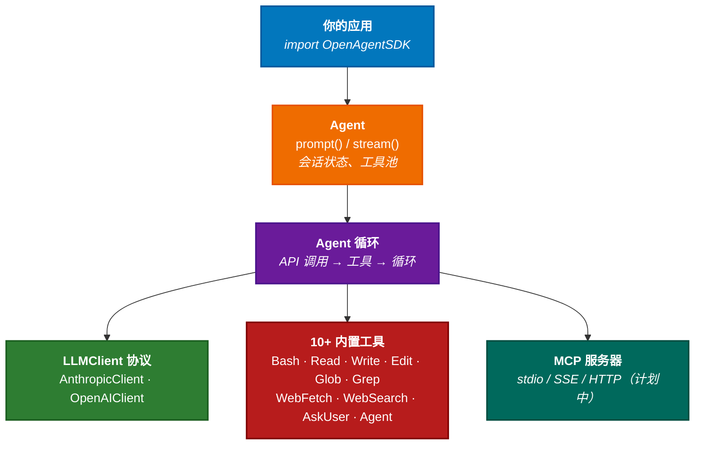

# Open Agent SDK (Swift)

[](https://swift.org)
[](https://developer.apple.com/macos/)
[](https://github.com/terryso/open-agent-sdk-swift/actions/workflows/ci.yml)
[](https://github.com/terryso/open-agent-sdk-swift/actions)
[](https://github.com/bmad-code-org/BMAD-METHOD)
[](./LICENSE)

[English](./README.md)

开源 Swift Agent SDK — 使用原生 Swift 并发在进程内运行完整的 Agent 循环。支持流式响应、10+ 内置工具、子 Agent 支持和多提供商 LLM 集成，快速构建 AI 应用。

> **灵感来自** [open-agent-sdk-typescript](https://github.com/codeany-ai/open-agent-sdk-typescript) — 将相同的 Agent 架构引入 Swift 生态。

其他语言版本：**TypeScript**: [open-agent-sdk-typescript](https://github.com/codeany-ai/open-agent-sdk-typescript) | **Go**: [open-agent-sdk-go](https://github.com/codeany-ai/open-agent-sdk-go)

## 项目状态

**已完成：**
- [x] 类型系统（消息、工具、错误、权限、会话、钩子）
- [x] SDK 配置（环境变量 + 编程式配置）
- [x] 多提供商 LLM 支持（Anthropic + OpenAI 兼容 API）
- [x] Agent 创建与完整的 Agent 循环
- [x] 流式和阻塞查询 API
- [x] 10 个内置工具（Bash、Read、Write、Edit、Glob、Grep、WebFetch、WebSearch、AskUser、ToolSearch）
- [x] 子 Agent 生成（Agent 工具，内置 Explore/Plan 类型）
- [x] 工具注册表（去重和过滤）
- [x] 错误处理与重试逻辑
- [x] CI 流水线（含代码覆盖率）

**开发中 / 计划中：**
- [ ] MCP（Model Context Protocol）集成
- [ ] 会话持久化
- [ ] 钩子系统执行（类型已定义）
- [ ] 预算追踪
- [ ] 权限系统执行
- [ ] 自动压缩
- [ ] NotebookEdit 工具

## 安装

### Swift Package Manager

在 `Package.swift` 中添加依赖：

```swift
dependencies: [
    .package(url: "https://github.com/terryso/open-agent-sdk-swift.git", from: "0.1.0")
],
targets: [
    .target(name: "YourApp", dependencies: ["OpenAgentSDK"])
]
```

### Xcode

File > Add Package Dependencies > 输入仓库地址。

## 快速开始

### 配置

通过环境变量设置 API Key：

```bash
export CODEANY_API_KEY=your-api-key
```

或编程式配置：

```swift
import OpenAgentSDK

let config = SDKConfiguration(
    apiKey: "sk-...",
    model: "claude-sonnet-4-6",
    baseURL: nil  // 可选，用于第三方提供商
)
```

### 创建 Agent

```swift
import OpenAgentSDK

let agent = createAgent(options: AgentOptions(
    apiKey: "sk-...",
    model: "claude-sonnet-4-6",
    systemPrompt: "你是一个有用的助手。",
    maxTurns: 10,
    permissionMode: .bypassPermissions
))
```

### 阻塞查询

```swift
let result = await agent.prompt("读取 Package.swift 并告诉我项目名称。")
print(result.text)
print("使用了 \(result.usage.inputTokens) 输入 + \(result.usage.outputTokens) 输出 token")
```

### 流式查询

```swift
for await message in agent.stream("读取 Package.swift 并告诉我项目名称。") {
    switch message {
    case .assistant(let data):
        print(data.text)
    case .toolUse(let data):
        print("使用工具: \(data.toolName)")
    case .result(let data):
        print("完成: \(data.text)")
    default:
        break
    }
}
```

### 多提供商支持

使用 OpenAI 兼容 API（GLM、Ollama、OpenRouter 等）：

```swift
let agent = createAgent(options: AgentOptions(
    provider: .openai,
    apiKey: "your-openai-key",
    model: "gpt-4o",
    baseURL: "https://api.openai.com/v1",
    systemPrompt: "你是一个有用的助手。"
))
```

或通过环境变量：

```bash
export CODEANY_API_KEY=your-key
export CODEANY_BASE_URL=https://api.openai.com/v1
export CODEANY_MODEL=gpt-4o
# Agent 将从 base URL 自动检测提供商
```

### 自定义工具

```swift
import OpenAgentSDK

let myTool = defineTool(
    name: "get_weather",
    description: "获取指定城市的当前天气",
    inputSchema: [
        "type": "object",
        "properties": [
            "city": ["type": "string", "description": "城市名称"]
        ],
        "required": ["city"]
    ]
) { input, context in
    let city = input["city"] as? String ?? "未知"
    return "\(city) 的天气：22°C，晴朗"
}

let agent = createAgent(options: AgentOptions(
    apiKey: "sk-...",
    tools: [myTool]
))
```

## 架构



## 环境变量

| 变量                  | 说明                                          |
| --------------------- | --------------------------------------------- |
| `CODEANY_API_KEY`     | API 密钥（必填）                              |
| `CODEANY_MODEL`       | 默认模型（默认：`claude-sonnet-4-6`）         |
| `CODEANY_BASE_URL`    | 自定义 API 地址，用于第三方提供商              |

## 内置工具

| 工具          | 说明                                    | 状态 |
| ------------- | --------------------------------------- | ---- |
| **Bash**      | 执行 Shell 命令，支持超时               | ✅    |
| **Read**      | 读取文件内容                            | ✅    |
| **Write**     | 创建或覆盖文件                          | ✅    |
| **Edit**      | 在文件中查找并替换                      | ✅    |
| **Glob**      | 按模式搜索文件                          | ✅    |
| **Grep**      | 使用正则表达式搜索文件内容              | ✅    |
| **WebFetch**  | 获取并读取网页                          | ✅    |
| **WebSearch** | 搜索网络                                | ✅    |
| **AskUser**   | 执行过程中向用户请求输入                | ✅    |
| **ToolSearch**| 搜索可用工具                            | ✅    |
| **Agent**     | 生成子 Agent（Explore、Plan 类型）      | ✅    |

## 系统要求

- Swift 6.1+
- macOS 13+

## 开发

```bash
# 构建
swift build

# 运行测试
swift test

# 在 Xcode 中打开
open Package.swift
```

## 致谢

本项目灵感来自 [open-agent-sdk-typescript](https://github.com/codeany-ai/open-agent-sdk-typescript)，该项目为 TypeScript/Node.js 生态提供了相同的 Agent 架构。

## 许可证

[MIT](./LICENSE)
