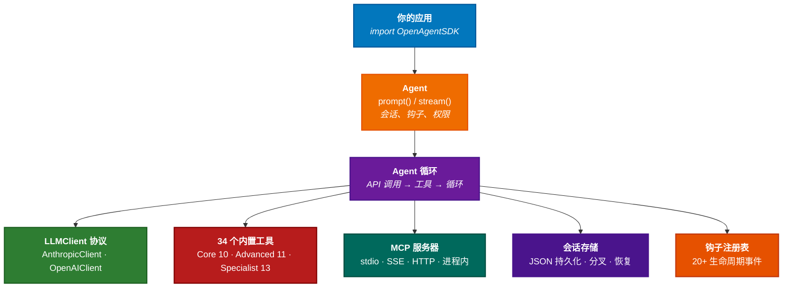

# Open Agent SDK (Swift)

[](https://swift.org)
[](https://developer.apple.com/macos/)
[](https://github.com/terryso/open-agent-sdk-swift/actions/workflows/ci.yml)
[](https://github.com/terryso/open-agent-sdk-swift/actions)
[](https://github.com/bmad-code-org/BMAD-METHOD)
[](./LICENSE)
[![zread](https://img.shields.io/badge/Ask_Zread-_.svg?style=flat&color=00b0aa&labelColor=000000&logo=data%3Aimage%2Fsvg%2Bxml%3Bbase64%2CPHN2ZyB3aWR0aD0iMTYiIGhlaWdodD0iMTYiIHZpZXdCb3g9IjAgMCAxNiAxNiIgZmlsbD0ibm9uZSIgeG1sbnM9Imh0dHA6Ly93d3cudzMub3JnLzIwMDAvc3ZnIj4KPHBhdGggZD0iTTQuOTYxNTYgMS42MDAxSDIuMjQxNTZDMS44ODgxIDEuNjAwMSAxLjYwMTU2IDEuODg2NjQgMS42MDE1NiAyLjI0MDFWNC45NjAxQzEuNjAxNTYgNS4zMTM1NiAxLjg4ODEgNS42MDAxIDIuMjQxNTYgNS42MDAxSDQuOTYxNTZDNS4zMTUwMiA1LjYwMDEgNS42MDE1NiA1LjMxMzU2IDUuNjAxNTYgNC45NjAxVjIuMjQwMUM1LjYwMTU2IDEuODg2NjQgNS4zMTUwMiAxLjYwMDEgNC45NjE1NiAxLjYwMDFaIiBmaWxsPSIjZmZmIi8%2BCjxwYXRoIGQ9Ik00Ljk2MTU2IDEwLjM5OTlIMi4yNDE1NkMxLjg4ODEgMTAuMzk5OSAxLjYwMTU2IDEwLjY4NjQgMS42MDE1NiAxMS4wMzk5VjEzLjc1OTlDMS42MDE1NiAxNC4xMTM0IDEuODg4MSAxNC4zOTk5IDIuMjQxNTYgMTQuMzk5OUg0Ljk2MTU2QzUuMzE1MDIgMTQuMzk5OSA1LjYwMTU2IDE0LjExMzQgNS42MDE1NiAxMy43NTk5VjExLjAzOTlDNS42MDE1NiAxMC42ODY0IDUuMzE1MDIgMTAuMzk5OSA0Ljk2MTU2IDEwLjM5OTlaIiBmaWxsPSIjZmZmIi8%2BCjxwYXRoIGQ9Ik0xMy43NTg0IDEuNjAwMUgxMS4wMzg0QzEwLjY4NSAxLjYwMDEgMTAuMzk4NCAxLjg4NjY0IDEwLjM5ODQgMi4yNDAxVjQuOTYwMUMxMC4zOTg0IDUuMzEzNTYgMTAuNjg1IDUuNjAwMSAxMS4wMzg0IDUuNjAwMUgxMy43NTg0QzE0LjExMTkgNS42MDAxIDE0LjM5ODQgNS4zMTM1NiAxNC4zOTg0IDQuOTYwMVYyLjI0MDFDMTQuMzk4NCAxLjg4NjY0IDE0LjExMTkgMS42MDAxIDEzLjc1ODQgMS42MDAxWiIgZmlsbD0iI2ZmZiIvPgo8cGF0aCBkPSJNNCAxMkwxMiA0TDQgMTJaIiBmaWxsPSIjZmZmIi8%2BCjxwYXRoIGQ9Ik00IDEyTDEyIDQiIHN0cm9rZT0iI2ZmZiIgc3Ryb2tlLXdpZHRoPSIxLjUiIHN0cm9rZS1saW5lY2FwPSJyb3VuZCIvPgo8L3N2Zz4K&logoColor=ffffff)](https://zread.ai/terryso/open-agent-sdk-swift)

[English](./README.md)

开源 Swift Agent SDK — 使用原生 Swift 并发在进程内运行完整的 Agent 循环。支持流式响应、34 个内置工具、子 Agent 编排、MCP 集成、会话持久化和多提供商 LLM 支持，快速构建 AI 应用。

> **灵感来自** [open-agent-sdk-typescript](https://github.com/codeany-ai/open-agent-sdk-typescript) — 将相同的 Agent 架构引入 Swift 生态。

其他语言版本：**TypeScript**: [open-agent-sdk-typescript](https://github.com/codeany-ai/open-agent-sdk-typescript) | **Go**: [open-agent-sdk-go](https://github.com/codeany-ai/open-agent-sdk-go)

## 特性亮点

- **完整 Agent 循环** — 单个 `await` 调用或流式 `AsyncStream` 即可完成提示、工具执行和响应
- **34 个内置工具** — Core 文件/搜索/Web 工具、Advanced 任务/团队管理、Specialist cron/plan/worktree 工具
- **多提供商 LLM** — Anthropic (Claude) 和 OpenAI 兼容 API（GLM、Ollama、OpenRouter 等）
- **MCP 集成** — 通过 stdio、SSE、HTTP 或进程内 MCP 服务器连接外部工具
- **会话持久化** — 保存、加载、分叉和管理对话记录为 JSON
- **钩子系统** — 20+ 生命周期事件，支持函数和 Shell 钩子处理
- **权限控制** — 6 种权限模式，支持自定义授权回调和策略组合
- **多 Agent 编排** — 生成子 Agent、管理团队、任务和 Agent 间消息传递
- **自动压缩** — 长对话自动压缩，保持在上下文窗口限制内
- **技能系统** — 5 个内置技能（Commit、Review、Simplify、Debug、Test），支持自定义技能注册
- **文件缓存与上下文** — LRU 文件缓存、Git 状态自动注入、项目文档发现（CLAUDE.md/AGENT.md）
- **运行时控制** — 动态模型切换、查询中断并获取部分结果、会话记忆
- **沙盒与日志** — 可配置的命令/路径沙盒限制，结构化 JSON 日志输出

## 快速入门（15 分钟）

### 安装

在 `Package.swift` 中添加依赖：

```swift
dependencies: [
    .package(url: "https://github.com/terryso/open-agent-sdk-swift.git", from: "0.1.0")
],
targets: [
    .target(name: "YourApp", dependencies: ["OpenAgentSDK"])
]
```

或在 Xcode 中：**File > Add Package Dependencies** 输入仓库地址。

### 配置

通过环境变量设置 API Key：

```bash
export CODEANY_API_KEY=sk-...
```

### 你的第一个 Agent

```swift
import OpenAgentSDK

let agent = createAgent(options: AgentOptions(
    apiKey: "sk-...",
    model: "claude-sonnet-4-6",
    systemPrompt: "你是一个有用的助手。",
    maxTurns: 10,
    permissionMode: .bypassPermissions
))

let result = await agent.prompt("用一段话解释 Swift 并发。")
print(result.text)
print("使用了 \(result.usage.inputTokens) 输入 + \(result.usage.outputTokens) 输出 token")
```

### 流式响应

```swift
// 使用上面创建的 agent：
for await message in agent.stream("读取 Package.swift 并总结。") {
    switch message {
    case .partialMessage(let data):
        print(data.text, terminator: "")
    case .toolUse(let data):
        print("使用工具: \(data.toolName)")
    case .result(let data):
        print("\n完成 (\(data.numTurns) 轮, $\(String(format: "%.4f", data.totalCostUsd)))")
    default:
        break
    }
}
```

### 自定义工具

```swift
struct WeatherInput: Codable {
    let city: String
}

let weatherTool = defineTool(
    name: "get_weather",
    description: "获取指定城市的当前天气",
    inputSchema: [
        "type": "object",
        "properties": [
            "city": ["type": "string", "description": "城市名称"]
        ],
        "required": ["city"]
    ]
) { (input: WeatherInput, context: ToolContext) in
    return "\(input.city) 的天气：22°C，晴朗"
}

let agent = createAgent(options: AgentOptions(
    apiKey: "sk-...",
    tools: [weatherTool]
))
```

## 高级功能

### 多提供商支持

使用 OpenAI 兼容 API（GLM、Ollama、OpenRouter 等）：

```swift
let agent = createAgent(options: AgentOptions(
    provider: .openai,
    apiKey: "sk-...",
    model: "gpt-4o",
    baseURL: "https://api.openai.com/v1",
    systemPrompt: "你是一个有用的助手。"
))
```

或通过环境变量：

```bash
export CODEANY_API_KEY=sk-...
export CODEANY_BASE_URL=https://api.openai.com/v1
export CODEANY_MODEL=gpt-4o
```

### 会话持久化

保存和恢复对话历史：

```swift
let sessionStore = SessionStore()

let agent = createAgent(options: AgentOptions(
    apiKey: "sk-...",
    sessionStore: sessionStore,
    sessionId: "my-session"
))

// 第一次对话会在 prompt/stream 后自动保存
let result = await agent.prompt("记住：我最喜欢的颜色是蓝色。")

// 在新进程中恢复 — 历史记录会自动加载
let agent2 = createAgent(options: AgentOptions(
    apiKey: "sk-...",
    sessionStore: sessionStore,
    sessionId: "my-session"
))
let result2 = await agent2.prompt("我最喜欢的颜色是什么？")
```

### 钩子系统

注册生命周期事件处理器：

```swift
let hookRegistry = HookRegistry()

await hookRegistry.register(.postToolUse, definition: HookDefinition(
    handler: { input in
        if let toolName = input.toolName {
            print("工具完成: \(toolName)")
        }
        return nil
    }
))

await hookRegistry.register(.preToolUse, definition: HookDefinition(
    matcher: "Bash",
    handler: { input in
        return HookOutput(message: "Bash 命令已阻止", block: true)
    }
))

let agent = createAgent(options: AgentOptions(
    apiKey: "sk-...",
    hookRegistry: hookRegistry
))
```

### 权限控制

选择 6 种内置权限模式或自定义策略：

```swift
// 内置模式
let agent = createAgent(options: AgentOptions(
    apiKey: "sk-...",
    permissionMode: .acceptEdits
))

// 自定义授权回调
agent.setCanUseTool { tool, input, context in
    if tool.name == "Bash" { return .deny("Bash 已禁用") }
    return .allow()
}

// 策略组合
let policy = CompositePolicy(policies: [
    ReadOnlyPolicy(),
    ToolNameDenylistPolicy(deniedToolNames: ["WebFetch"])
])
agent.setCanUseTool(canUseTool(policy: policy))
```

### MCP 集成

通过 MCP（Model Context Protocol）连接外部工具服务器：

```swift
let agent = createAgent(options: AgentOptions(
    apiKey: "sk-...",
    mcpServers: [
        "filesystem": .stdio(McpStdioConfig(
            command: "npx",
            args: ["-y", "@modelcontextprotocol/server-filesystem", "/tmp"]
        )),
        "remote": .sse(McpSseConfig(
            url: "http://localhost:3001/sse"
        ))
    ]
))
// MCP 工具会被自动发现并合并到 Agent 的工具池中
```

### 预算控制

设置成本上限来控制 LLM 开销：

```swift
let agent = createAgent(options: AgentOptions(
    apiKey: "sk-...",
    maxBudgetUsd: 0.10  // 成本超过 $0.10 时停止
))
```

### 技能系统

注册内置或自定义技能，封装提示词模板和工具限制：

```swift
import OpenAgentSDK

// 内置技能自动注册
let registry = SkillRegistry()
registry.register(BuiltInSkills.commit)
registry.register(BuiltInSkills.review)

// 注册自定义技能
let explainSkill = Skill(
    name: "explain",
    description: "详细解释代码",
    promptTemplate: "读取指定文件并逐行解释代码...",
    toolRestrictions: [.bash, .read, .glob, .grep]
)
registry.register(explainSkill)

let agent = createAgent(options: AgentOptions(
    apiKey: "sk-...",
    tools: getAllBaseTools(tier: .core) + [createSkillTool(registry: registry)]
))
```

### 运行时模型切换

在对话中切换 LLM 模型，支持按模型追踪成本：

```swift
let agent = createAgent(options: AgentOptions(
    apiKey: "sk-...",
    model: "claude-sonnet-4-6"
))

// 简单问题使用快速模型
let result1 = await agent.prompt("简单问题...")

// 切换到强力模型处理复杂任务
try agent.switchModel("claude-opus-4-6")
let result2 = await agent.prompt("分析这个复杂代码库...")
// result2.usage.costBreakdown 包含各模型的独立计数
```

### 查询中断

取消正在执行的查询并获取部分结果：

```swift
let task = Task {
    for await message in agent.stream("长时间分析任务...") {
        // 处理事件
    }
}

// 超时后取消
task.cancel()
// Agent 返回 QueryResult，isCancelled=true，包含部分结果
```

### 上下文注入

自动注入 Git 状态和发现项目文档：

```swift
let agent = createAgent(options: AgentOptions(
    apiKey: "sk-...",
    projectRoot: "/path/to/project"  // 自动发现 CLAUDE.md、AGENT.md
))
// 系统提示现在包含 <git-context> 和 <project-instructions> 块
```

### 沙盒与日志

限制 Agent 操作范围并捕获结构化日志：

```swift
let agent = createAgent(options: AgentOptions(
    apiKey: "sk-...",
    sandbox: SandboxSettings(
        allowedReadPaths: ["/project/"],
        allowedWritePaths: ["/project/src/"],
        deniedCommands: ["rm", "sudo"]
    ),
    logLevel: .debug,
    logOutput: .custom { jsonLine in
        // 集成到 ELK、Datadog 等系统
        print(jsonLine)
    }
))
```

## 内置工具

### Core 工具（10 个）

| 工具          | 说明                                    |
| ------------- | --------------------------------------- |
| **Bash**      | 执行 Shell 命令，支持超时               |
| **Read**      | 读取文件内容                            |
| **Write**     | 创建或覆盖文件                          |
| **Edit**      | 在文件中查找并替换                      |
| **Glob**      | 按模式搜索文件                          |
| **Grep**      | 使用正则表达式搜索文件内容              |
| **WebFetch**  | 获取并读取网页                          |
| **WebSearch** | 搜索网络                                |
| **AskUser**   | 执行过程中向用户请求输入                |
| **ToolSearch**| 搜索可用工具                            |

### Advanced 工具（11 个）

| 工具              | 说明                                          |
| ----------------- | --------------------------------------------- |
| **Agent**         | 生成子 Agent（Explore、Plan 类型）            |
| **SendMessage**   | 在 Agent 之间发送消息                         |
| **TaskCreate**    | 创建带描述的任务                              |
| **TaskList**      | 列出所有任务，支持状态过滤                    |
| **TaskUpdate**    | 更新任务状态和负责人                          |
| **TaskGet**       | 按 ID 获取任务详情                            |
| **TaskStop**      | 停止正在运行的任务                            |
| **TaskOutput**    | 获取已完成任务的输出                          |
| **TeamCreate**    | 创建多 Agent 协调团队                         |
| **TeamDelete**    | 删除团队并清理资源                            |
| **NotebookEdit**  | 编辑 Jupyter notebook 单元格                  |

### Specialist 工具（13 个）

| 工具                 | 说明                                          |
| -------------------- | --------------------------------------------- |
| **WorktreeEnter**    | 进入隔离的工作树工作区                        |
| **WorktreeExit**     | 退出并可选移除工作树                          |
| **PlanEnter**        | 进入计划模式进行结构化规划                    |
| **PlanExit**         | 退出计划模式回到执行模式                      |
| **CronCreate**       | 创建定时任务                                  |
| **CronDelete**       | 删除定时任务                                  |
| **CronList**         | 列出所有定时任务                              |
| **RemoteTrigger**    | 触发远程 Webhook 或事件                       |
| **LSP**              | Language Server Protocol 集成                 |
| **Config**           | 读写 SDK 配置值                               |
| **TodoWrite**        | 管理待办事项列表，支持优先级                  |
| **ListMcpResources** | 列出可用的 MCP 服务器资源                     |
| **ReadMcpResource**  | 读取指定的 MCP 资源                           |

## 架构



## 环境变量

| 变量                  | 说明                                          |
| --------------------- | --------------------------------------------- |
| `CODEANY_API_KEY`     | API 密钥（必填）                              |
| `CODEANY_MODEL`       | 默认模型（默认：`claude-sonnet-4-6`）         |
| `CODEANY_BASE_URL`    | 自定义 API 地址，用于第三方提供商              |

## 文档

API 文档和指南通过 Swift-DocC 提供：

- [快速入门](Sources/OpenAgentSDK/Documentation.docc/GettingStarted.md) — 15 分钟入门教程
- [工具系统](Sources/OpenAgentSDK/Documentation.docc/ToolSystem.md) — 工具协议、自定义工具、层级
- [多 Agent 编排](Sources/OpenAgentSDK/Documentation.docc/MultiAgent.md) — 子 Agent、团队、任务
- [MCP、会话与钩子](Sources/OpenAgentSDK/Documentation.docc/MCPSessionHooks.md) — MCP 集成、持久化、钩子系统
- [可运行示例](Examples/README.md) — 31 个完整示例，含逐步教程（19 个功能演示 + 12 个兼容性验证）

## 系统要求

- Swift 6.1+
- macOS 13+

## 开发

```bash
# 构建
swift build

# 运行测试
swift test

# 在 Xcode 中打开
open Package.swift
```

## 致谢

本项目灵感来自 [open-agent-sdk-typescript](https://github.com/codeany-ai/open-agent-sdk-typescript)，该项目为 TypeScript/Node.js 生态提供了相同的 Agent 架构。

## 许可证

[MIT](./LICENSE)
