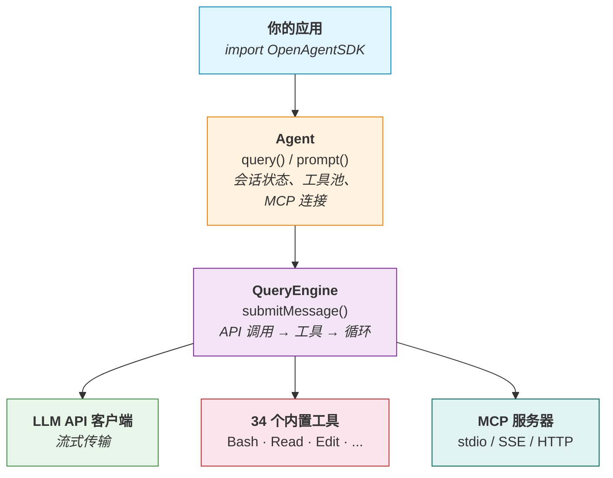

# Open Agent SDK (Swift)

[](https://swift.org)
[](https://developer.apple.com/macos/)
[](./LICENSE)
[](https://github.com/bmad-code-org/BMAD-METHOD)

[English](./README.md)

开源 Swift Agent SDK — 使用原生 Swift 并发在进程内运行完整的 Agent 循环。支持流式响应、内置工具和 MCP 协议，快速构建 AI 应用。

> **灵感来自** [open-agent-sdk-typescript](https://github.com/codeany-ai/open-agent-sdk-typescript) — 将相同的 Agent 架构引入 Swift 生态。

其他语言版本：**TypeScript**: [open-agent-sdk-typescript](https://github.com/codeany-ai/open-agent-sdk-typescript) | **Go**: [open-agent-sdk-go](https://github.com/codeany-ai/open-agent-sdk-go)

## 项目状态

本项目处于**早期开发阶段**。基础模块（类型系统、配置、API 客户端、Agent 创建）已完成，Agent 循环、内置工具等高级功能即将推出。

**已完成：**
- [x] 类型系统（消息、工具、错误、权限、会话、钩子）
- [x] SDK 配置（环境变量 + 编程式配置）
- [x] Anthropic API 客户端（支持流式响应）
- [x] Agent 创建与配置
- [x] CI 流水线

**开发中 / 计划中：**
- [ ] Agent 循环（QueryEngine）
- [ ] 34 个内置工具（Bash、Read、Write、Edit、Glob、Grep ...）
- [ ] MCP（Model Context Protocol）集成
- [ ] 会话持久化
- [ ] 钩子系统（21 个生命周期事件）
- [ ] 多 Agent 协作
- [ ] 预算追踪
- [ ] 权限系统
- [ ] 自动压缩

## 安装

### Swift Package Manager

在 `Package.swift` 中添加依赖：

```swift
dependencies: [
    .package(url: "https://github.com/terryso/open-agent-sdk-swift.git", from: "0.1.0")
],
targets: [
    .target(name: "YourApp", dependencies: ["OpenAgentSDK"])
]
```

### Xcode

File > Add Package Dependencies > 输入仓库地址。

## 快速开始

### 配置

通过环境变量设置 API Key：

```bash
export CODEANY_API_KEY=your-api-key
```

或编程式配置：

```swift
import OpenAgentSDK

let config = SDKConfiguration(
    apiKey: "sk-...",
    model: "claude-sonnet-4-6",
    baseURL: nil  // 可选，用于第三方提供商
)
```

支持第三方提供商（如 OpenRouter）：

```bash
export CODEANY_BASE_URL=https://openrouter.ai/api
export CODEANY_API_KEY=sk-or-...
export CODEANY_MODEL=anthropic/claude-sonnet-4
```

### 创建 Agent

```swift
import OpenAgentSDK

let agent = createAgent(options: AgentOptions(
    apiKey: "sk-...",
    model: "claude-sonnet-4-6",
    systemPrompt: "你是一个有用的助手。",
    maxTurns: 10,
    permissionMode: .bypassPermissions
))
```

### 流式查询（即将推出）

```swift
for await message in agent.query("读取 Package.swift 并告诉我项目名称。") {
    switch message {
    case .assistant(let content):
        print(content)
    case .toolUse(let tool, let input):
        print("使用工具: \(tool)")
    case .result(let summary):
        print("完成: \(summary)")
    default:
        break
    }
}
```

## 架构



## 环境变量

| 变量                  | 说明               |
| --------------------- | ------------------ |
| `CODEANY_API_KEY`     | API 密钥（必填）   |
| `CODEANY_MODEL`       | 默认模型覆盖       |
| `CODEANY_BASE_URL`    | 自定义 API 地址    |

## 内置工具（计划中）

| 层级        | 工具                                                                    |
| ----------- | ----------------------------------------------------------------------- |
| **核心**    | Bash、Read、Write、Edit、Glob、Grep、WebFetch、WebSearch、AskUser、ToolSearch |
| **高级**    | NotebookEdit、Agent（子Agent）、任务管理、团队协作、SendMessage、EnterWorktree、EnterPlanMode |
| **专家**    | LSP、MCP 资源、定时任务、远程触发、Config |

## 系统要求

- Swift 6.1+
- macOS 13+

## 开发

```bash
# 构建
swift build

# 运行测试
swift test

# 在 Xcode 中打开
open Package.swift
```

## 致谢

本项目灵感来自 [open-agent-sdk-typescript](https://github.com/codeany-ai/open-agent-sdk-typescript)，该项目为 TypeScript/Node.js 生态提供了相同的 Agent 架构。

## 许可证

[MIT](./LICENSE)
